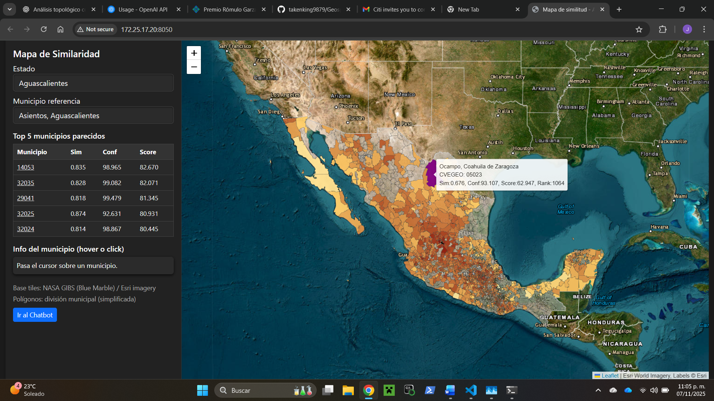
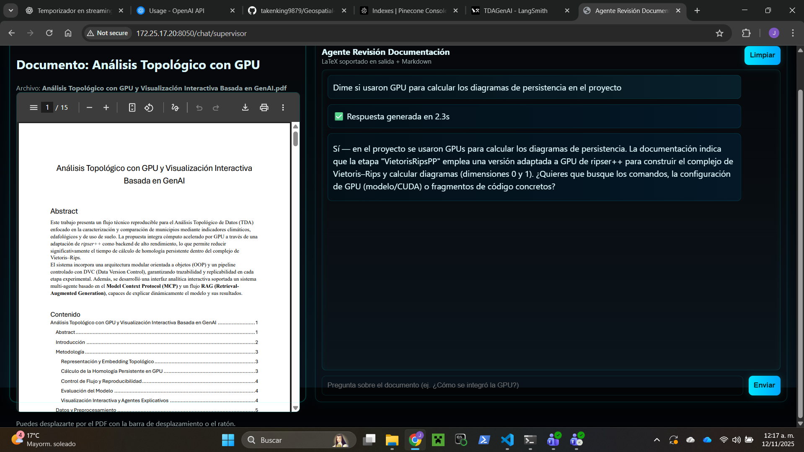

<div align="center">

# 🌎 Geospatial Similarity Combining TDA, LLM-Agents and MLOps Workflows

[](https://www.python.org/)
[](https://dvc.org/)
[](https://www.langchain.com/)
[](https://flask.palletsprojects.com/)
[](https://www.docker.com/)
[](https://aws.amazon.com/)
[](https://www.terraform.io/)
[](https://github.com/Ripser/ripser)
[](https://smith.langchain.com/)
[](https://huggingface.co/)
[](https://platform.openai.com/)
[](https://modelcontextprotocol.io/)

---

</div>

## 📋 Descripción General

**Autor:** Jorge Ángel Manzanares Cortés  
**Proyecto:** Análisis Topológico con GPU y Visualización Interactiva Basada en GenAI

Este proyecto aborda el **Análisis Topológico de Datos (TDA)** aplicado a la comparación de municipios mexicanos mediante indicadores **climáticos**, **edafológicos** y de **uso de suelo**, integrando un flujo de trabajo reproducible con **MLOps**, **multi-agentes** y **RAG pipelines**.

---

## 🔗 Fuentes de Datos

- 🌾 **Agricultura:** [Para dónde se cultiva qué, cuántas hectáreas hay y valor de producción](https://nube.agricultura.gob.mx/datosAbiertos/Agricola.php)  
- 🌿 **Uso de Suelo y Vegetación:** [INEGI - Uso de Suelo y Vegetación](https://www.inegi.org.mx/app/biblioteca/ficha.html?upc=889463842781)  
- 🌍 **Edafología:** [INEGI - Carta Edafológica](https://www.inegi.org.mx/app/biblioteca/ficha.html?upc=702825266707)  
- 🏔️ **División Política:** [CONABIO - División Política](http://www.conabio.gob.mx/informacion/gis/maps/geo/mun22gw.zip)  
- 🌦️ **Climatología:** [SMN - Información Estadística Climatológica](https://smn.conagua.gob.mx/es/climatologia/informacion-climatologica/informacion-estadistica-climatologica)

---

## ⚙️ Tecnologías Implementadas

- **GPU computing:** Integración de Ripser++ como back-end acelerado para el cálculo de Homología Persistente en giotto-tda
- **Infraestructura reproducible:** DVC, Terraform y AWS (EC2 + ECR)  
- **Embeddings:** HuggingFace + OpenAI  
- **Sistemas multi-agente:** Arquitectura MCP con agentes supervisores  
- **RAG Pipeline:** LangChain + LangSmith (monitoreo y trazabilidad de costos)  
- **MLOps:** Integración con Docker, CI/CD y gestión de versiones  

---

## 🧠 Descripción Técnica (resumen)

El flujo técnico desarrollado para el **Análisis Topológico de Datos (TDA)** combina **cómputo acelerado por GPU** con prácticas modernas de reproducibilidad científica. Se implementó una **arquitectura modular OOP**, optimizando la construcción del **complejo de Vietoris–Rips** mediante **ripser++**. Se integraron agentes MCP y un pipeline RAG para explicación dinámica y recuperación de contexto. El objetivo es comparar municipios y generar un índice de similitud usando datos de suelo, clima y uso de suelo.

---

## 📂 Datos y Preprocesamiento

### Objetivo general y datos de entrada
El objetivo de esta etapa es encontrar, para un conjunto de municipios “interesantes” (aquellos con buen desempeño agrícola), otros municipios similares en condiciones de suelo y clima, combinando **distancias edafológicas y uso de suelo (Gower)** y **distancias topológicas (TDA)** calculadas sobre series climáticas. Además, se incluyen diferencias de magnitud en las variables para capturar tanto la **forma** como la **escala** de las señales.

**Entradas principales:**
- Polígonos municipales (división política nacional).  
- Polígonos de uso de suelo (cobertura completa de México).  
- Puntos de edafología (muestras puntuales, múltiples por municipio).  
- Series climáticas por estación (Tmax, Tmin, Precip, Evap) para el periodo 2013–2024, obtenidas de fuentes oficiales.  
- Datos de evaluación agrícola (siembra, cosecha, siniestrado, rendimiento, valor de producción).

**Salida esperada:**  
Una matriz de similitud entre 1 630 municipios candidatos y 123 municipios “interesantes”, acompañada de una matriz de confianza de dimensiones (1630 × 123), derivada del modelo topológico.

---

### Preprocesamiento de uso de suelo y edafología

El procesamiento espacial inicial integró las capas de uso de suelo y edafología con los polígonos municipales para generar un conjunto homogéneo de características por municipio.

**Procesos realizados:**
1. **Intersección espacial:** entre polígonos de uso de suelo y límites municipales, calculando el porcentaje de área ocupada por cada categoría de uso.  
2. **Agregación de puntos edafológicos por municipio:**  
   - Variables categóricas: **moda**.  
   - Variables numéricas: **media**.  
   (Consolida múltiples registros en una sola fila por municipio.)  
3. **Imputación espacial:** para municipios sin puntos edafológicos, se calcularon los centroides municipales y se buscaron hasta **5 vecinos** dentro de un radio de **20 km**, exigiendo al menos uno válido para imputar.

**Justificación:**  
El uso de moda/media mantiene la representatividad local, mientras que el umbral de 20 km con hasta 5 vecinos logra un equilibrio entre cobertura y fidelidad espacial, evitando extrapolaciones excesivas.

**Salida:**  
Un dataset de suelo + edafología por municipio, almacenado en formato **Parquet** con precisión `float32`.

---

### Preprocesamiento climático

**Selección y limpieza de datos:**
- Variables consideradas: **Tmax, Tmin, Precip**. (Se descartó Evap por ≈50 % de valores faltantes y alta varianza.)  
- Periodo: **2013–mediados de 2024**, limitado por discontinuidades finales.  
- Estaciones con más de **40 % de NaNs** en cualquiera de las tres series fueron eliminadas → resultado: ≈2400 → ≈2100 estaciones retenidas.  
- Los NaNs en las series restantes fueron **interpolados** para asegurar continuidad antes de aplicar la incrustación de Takens.

**Asignación a municipios:**
- Si una estación cae dentro de un polígono municipal, se calculan promedios (si hay múltiples estaciones).  
- Para municipios sin estaciones, se aplica búsqueda de vecinos (radio 20 km, 5 vecinos), elevando la cobertura municipal de ~41 % a ~77 %.

**Salida:**  
Series climáticas por municipio (Tmax, Tmin, Precip) y sus promedios, almacenados en Parquet `float32`.

**Justificación:**  
El umbral del 40 % equilibra retención y calidad; la interpolación suaviza huecos largos que afectarían la estabilidad de los embeddings topológicos.

---

### Dataset de evaluación agrícola: índice y discretización

Para cada combinación municipio × cultivo se calculó la media de los registros de producción, evitando sesgos por diferencias en área cultivada.

**Índice continuo de productividad:**  

$$
\mathrm{Index}_{\mathrm{prod}}
= \frac{(\mathrm{Rendimiento}\times \mathrm{Cosechada}) - \mathrm{Siniestrada}}{\mathrm{Sembrada}}
$$

El índice se normaliza por cultivo y posteriormente se discretiza en **6 categorías ordinales**:

| Categoría | Descripción |
|---:|---|
| 0 | No aplica |
| 1 | Muy malo |
| 2 | Malo |
| 3 | Regular |
| 4 | Bueno |
| 5 | Excelente |

**Salida:**  
Matriz de evaluación agrícola (municipio × cultivo) en Parquet.

**Razonamiento:**  
El promedio evita confundir municipios extensos con mejores condiciones intrínsecas; la escala ordinal facilita cálculo de similitudes agrícolas.

---

### Selección de municipios “interesantes”

Proceso jerárquico:

1. Municipios con categoría **Excelente (5)** en al menos un cultivo → **619** municipios.  
2. Retener municipios Excelente en ≥ 3 cultivos → **152** municipios.  
3. Intersección con municipios con datos completos de suelo, clima y evaluación → **123** municipios finales de interés.

**Conjuntos finales:**
- Candidatos: **1630** municipios (datos completos).  
- Objetivos: **123** municipios de referencia.

**Justificación:**  
Comparar los 1630 × 1630 diagramas sería inviable; reducir a 123 mantiene foco en casos de alto interés productivo.

---

## 🔬 Modelo y Evaluación

### Distancias de suelo (Gower)  
Se calculó la distancia de **Gower** entre los 1 630 candidatos y los 123 objetivos, generando la matriz

$$
D_{\mathrm{gower}} \in \mathbb{R}^{1630 \times 123}.
$$

Cada columna (municipio objetivo) se normalizó por **Min–Max** a \([0,1]\).

**Justificación:**  
Gower maneja variables mixtas (numéricas y categóricas) y es robusta para características edafológicas y uso de suelo.

---

### Pipeline TDA para series climáticas (Takens → Vietoris–Rips)

Para cada variable climática (Tmax, Tmin, Precip) se ejecutó:

1. **TakensEmbedding:** series → nube de puntos en espacio de fases. Parámetros (delay, dim) determinados por tipo de serie y promediados entre estaciones.  
2. **CollectionTransformer (PCA):** reducción dimensional.  
3. **VietorisRipsPP:** cálculo de diagramas de persistencia (dim 0 y 1) usando VietorisRipsPP adaptado a GPU (ripser++).  
4. **Scaler:** normalización de diagramas.  
5. **Filtering:** eliminación de puntos con vida corta (ruido).

**Parámetros finales (balance costo/detalle):**
- `stride = 3` → reduce ~4199 → ≈1400 puntos.  
- **Tmax:** `delay=23`, `dim=8`, `\varepsilon=0.08`  
- **Tmin:** `delay=23`, `dim=8`, `\varepsilon=0.085`  
- **Precip:** `delay=21`, `dim=12`, `\varepsilon=0.05`

Salida: diagramas de persistencia para 1630 candidatos × 123 objetivos.  
Se calculó la **distancia de Wasserstein** entre diagramas, obteniendo matrices

$$
D_{\mathrm{tda}}^{(v)} \in \mathbb{R}^{1630 \times 123}, \qquad v\in\{\mathrm{Tmax},\mathrm{Tmin},\mathrm{Precip}\}.
$$

Cada $$\(D_{\mathrm{tda}}^{(v)}\)$$ se normalizó por columna (Min–Max).

---

### Magnitud física y combinación Hadamard (estructura + magnitud)

Procedimiento por variable climática \(v\):

1. Calcular la **media temporal 2013–2024** por municipio (magnitud física).  
2. Construir matriz de **diferencias absolutas de magnitud**:

$$
D_{\mathrm{diff}}^{(v)} \in \mathbb{R}^{1630 \times 123}.
$$

Normalizar por columna (Min–Max).  

3. Combinar topología y magnitud por **producto de Hadamard**:

$$
D_{\mathrm{had}}^{(v)} = D_{\mathrm{tda}}^{(v)} \circ D_{\mathrm{diff}}^{(v)},
$$

donde \(\circ\) indica producto elemento a elemento (Hadamard).  

4. Re-normalizar por columna → matrices finales $$\(D_{\mathrm{tmax}}, D_{\mathrm{tmin}}, D_{\mathrm{precip}}\)$$.

**Justificación:**  
TDA captura estructura; la diferencia de magnitud evita que ciclos iguales con niveles distintos sean equiparados. El Hadamard asegura contribución conjunta.

---

### Índice final de similitud (combinación ponderada)

Para cada par (i candidato, j objetivo) definimos:

$$
D_{ij} = w_1\,D_{\mathrm{tmax},ij} + w_2\,D_{\mathrm{tmin},ij} + w_3\,D_{\mathrm{precip},ij} + w_4\,D_{\mathrm{gower},ij},
$$

sujeto a la restricción de pesos

$$
\sum_{k=1}^{4} w_k = 1, \qquad w_k \ge 0.
$$

Cada componente \(D\) fue normalizada previamente por columna (Min–Max). El índice final no se renormaliza adicionalmente (la ponderación garantiza comparabilidad relativa).

---

### Métrica de evaluación (validación del índice)

Comparación entre predicción \(D_{ij}\) y similitud empírica \(S_{ij}\) derivada de rendimientos agrícolas.

Para cada par \((i,j)\):
- \(K_{ij}\): número de cultivos compartidos.  
- Para cada cultivo \(k\) compartido, etiquetas discretizadas \(C_{ik}, C_{jk}\in\{1,\dots,5\}\).

Definimos la similitud empírica como:

$$
S_{ij} =
\begin{cases}
\displaystyle
\frac{1}{K_{ij}} \sum_{k \in \mathcal{C}_{ij}} \frac{4 - | C_{ik} - C_{jk} |}{4}, & K_{ij} > 0,\\[2ex]
\mathrm{NaN}, & K_{ij} = 0.
\end{cases}
$$

La confianza por par se define como:

$$
\mathrm{Conf}_{ij} = 1 - \big\lvert D_{ij} - S_{ij} \big\rvert,
\qquad \mathrm{Conf}_{ij} \in [0,1].
$$

- Confianza por objetivo \(j\): promedio de $$\(\mathrm{Conf}_{ij}\)$$ sobre todos los candidatos \(i\) con \(K_{ij}>0\).  
- Confianza general: promedio global de confianzas por objetivo.

**Optimización de pesos:**  
Se generaron **1000 combinaciones aleatorias** (con $$\(\sum_k w_k = 1\)$$) y se refinó localmente el mejor candidato. El refinamiento no cambió sustancialmente la solución (estable).

---

## 📈 Resultados obtenidos

**Pesos óptimos estimados (w_k):**

| Componente | Peso (w_k) |
|---|---:|
| Tmax | 0.0922 |
| Tmin | 0.0639 |
| Precip | 0.3525 |
| Suelo (Gower) | 0.4919 |

(La suma total ≈ 1, dentro de redondeos numéricos.)

**Desempeño global del modelo:**
- Confianza general: ≈ **86 %**  
- Estadísticas por municipio objetivo (n = 123):  
  - Media: **86.56 %**  
  - Desviación estándar: **10.74**  
  - Mínimo: **36.68 %**  
  - Máximo: **100 %**

**Experimentos con normalización (variantes):**

| Variante | Descripción | Confianza (%) | Desviación Est. | Resultado |
|---|---|---:|---:|---|
| (1) | Normalizar Hadamard y Gower; no normalizar índice final | 86.56 | 10.74 | Mejor |
| (2) | Sin normalizar Hadamard/Gower; normalizar índice final | 86.02 | (mayor) | — |
| (3) | Normalizar ambos y luego el índice final | 86.00 | (mayor) | — |

**Decisión adoptada:** variante (1) por mejor balance entre precisión y estabilidad.

**Interpretación:**  
La mayor contribución proviene del componente **suelo (~49%)**, seguido por **precipitación (~35%)**; las temperaturas Tmax (~9%) y Tmin (~6%) influyen menos. Esto sugiere que condiciones del suelo y patrones de precipitación son principales determinantes de similitud productiva entre municipios.

---

## 🧭 Estructura general de la aplicación

La aplicación cuenta con **tres pestañas principales**, cada una enfocada en una parte distinta del análisis y la interacción con los modelos.

---

### 🗺️ **1. Mapa de similitud geoespacial**

Muestra un **mapa interactivo de México** dividido por municipios.

<p align="center">
  
  <br>
  <i>Figura 1. Mapa interactivo coloreado por índice de similitud.</i>
</p>

- Inicialmente los polígonos municipales están **transparentes**.  
- El usuario elige un municipio en el **menú desplegable** (dropdown).  
- Al seleccionar un municipio:
  - El municipio elegido se **marca en negro**.
  - Todos los demás municipios se **colorean automáticamente** según su **valor de similitud** con el municipio seleccionado (calculado por el modelo), y los que no tienen datos se mantienen **transparentes**.  
  - Al **hacer clic en un municipio**, el mapa **hace zoom** y lo **resalta en morado**.
- Un panel adicional muestra una **tabla con los cinco municipios más similares** al seleccionado, incluyendo:
  - El valor de similitud, el de confianza y su ranking en el score (similitud × confianza).
  - Un **enlace** que centra el mapa en dicho municipio al hacer clic.
- Al **pasar el cursor** sobre un municipio:
  - Se muestra la **similitud del modelo**.
  - La **similitud empírica (confianza)** derivada del **índice agrícola real** (calculado a partir de producción, rendimiento y valor económico).

> 💡 En conjunto, esta pestaña permite visualizar la coherencia entre el modelo de similitud y los datos agrícolas reales, además de explorar relaciones espaciales entre municipios.

---

### 🤖 **2. Agente de recomendación**

Un sistema de **agentes colaborativos (multi-agente)** que asisten al usuario en la exploración y generación de ideas.

<p align="center">
  
  <br>
  <i>Figura 2. Ejemplo de interacción con el agente analista.</i>
</p>

- **Agente 1:** Reformula el prompt del usuario para hacerlo más claro y efectivo para que las herramientas puedan usarse.  
- **Agente 2:** Responde con **recomendaciones prácticas**, tales como:
  - Municipios similares donde podría replicarse un cultivo.
  - Cultivos potenciales para un municipio específico.
  - Zonas donde **ya se cultiva** cierta especie.
- Permite explorar escenarios y obtener sugerencias fundamentadas en los datos modelados.

---

### 📘 3. Documentación interactiva

Un entorno que combina **lectura y asistencia inteligente**.

<div style="display: flex; flex-wrap: wrap; justify-content: center; gap: 20px; margin-bottom: 30px;">

  <figure style="flex: 1 1 300px; text-align: center; min-width: 250px;">
    
    <figcaption><i>Figura 3. Respuesta sobre documentación</i></figcaption>
  </figure>

  <figure style="flex: 1 1 300px; text-align: center; min-width: 250px;">
    
    <figcaption><i>Figura 4. Respuesta sobre homología</i></figcaption>
  </figure>

</div>

- A la **izquierda** se muestra el **PDF de la documentación completa** del proyecto.  
- A la **derecha** se ubica un **agente explicativo**, capaz de:
  - Responder preguntas sobre la documentación.
  - Aclarar conceptos matemáticos, técnicos o metodológicos.
  - Generar ejemplos y resúmenes en lenguaje natural.

> 🧠 Esta vista convierte la documentación estática en un entorno de aprendizaje y consulta interactiva.
---

## 🧩 Conjunto de Herramientas Inteligentes (Tools)

El sistema cuenta con dos agentes principales — **Analista** y **Supervisor** — cada uno con su propio conjunto de herramientas registradas como `@tool`, diseñadas para exploración geoespacial, recomendaciones agrícolas y comprensión de la documentación.

---

### 🤖 **Agente Analista**

Herramientas enfocadas en análisis agroambiental, recomendación de cultivos y comparación entre municipios.

| Tool | Descripción |
|------|--------------|
| `recomendar_municipios_por_cultivo` | Dado un cultivo, identifica **nuevos municipios potenciales** para su siembra y compara con los actuales productores. Calcula un *score = similitud × confianza*. |
| `recomendar_cultivos_por_municipio` | Dado un municipio, sugiere **nuevos cultivos prometedores** basados en municipios similares y sus prácticas agrícolas. |
| `cultivos_comunes` | Compara dos municipios y devuelve **los cultivos que comparten**, junto con su rendimiento y diferencia de desempeño. |
| `top_municipios_cultivo` | Devuelve los **N municipios con mayor valor** para un cultivo específico. |
| `top_cultivos_municipio` | Devuelve los **N cultivos principales** de un municipio según su índice de productividad. |

> 🧠 Estas herramientas permiten al agente identificar patrones agrícolas, sugerir cultivos viables y explorar relaciones entre municipios desde una perspectiva de similitud estructural y empírica.

---

### 🧭 **Supervisor (Documentación y Recuperación de Contexto)**

Herramientas enfocadas en acceso a documentación técnica, búsqueda en la web y soporte multiagente MCP.

| Tool | Descripción |
|------|--------------|
| `retrieve_context` | Recupera pasajes relevantes desde la **documentación interna o PDFs** usando embeddings semánticos. Ideal para preguntas sobre la implementación. |
| `duckduckgo_search` | Realiza búsquedas generales en la web mediante **DuckDuckGo**, limitando a los 3 resultados más relevantes. |
| `context_retriever` | Usa el **agente de contexto** para responder preguntas técnicas basadas en la documentación del proyecto. |
| `web_retriever` | Usa el **agente web** (con Tavily, DuckDuckGo o Wikipedia MCP)** para obtener información externa. |

> 🔗 El supervisor puede combinar fuentes locales (documentación interna) con externas (web, Wikipedia, Tavily MCP), logrando respuestas híbridas y trazables.

---

### ⚙️ Integración Multiagente

El proyecto utiliza **MCP (Model Context Protocol)** para coordinar agentes y orígenes de información externos:

```python
client = MultiServerMCPClient({
    "tavily": {
        "transport": "streamable_http",
        "url": "https://mcp.tavily.com/mcp",
        "headers": {"Authorization": f"Bearer {TAVILY_API_KEY}"}
    }
})
tools_mcp = await client.get_tools()
```
---

## 🧑‍💻 Autor

**Jorge Ángel Manzanares Cortés**  
🌐 [[Enlace a portafolio o GitHub si lo deseas](https://github.com/takenking9879)]

---
